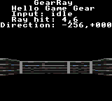

# Sprint 11 Task 108: optimization pass 1

## Scope

Exactly one optimization was made: native wall-row bitplane packing in
`platform/game_gear/video.c` now uses two exact 16-by-4 constant bitplane maps.
Texture sampling, palette mapping, projection, dirty-column traversal, VRAM
operations, raycasting, gameplay, and every other subsystem are unchanged.

## Assembly evidence

The Task 107 profiling report identified the old row packer as part of the
hottest path. It is called eight times per `TBLD`. Its generated Z80 loop ran
four times per call and, on every iteration:

- loaded both palette indices again from the stack;
- loaded the mutable bitplane mask twice;
- shifted and stored that mask;
- updated and tested a loop counter;
- took a backward loop branch;
- conditionally formed the high and low output nibbles.

The new generated function has no backward branch, mutable mask, mask shift,
loop counter, or per-bitplane palette argument reload. It calculates two table
pointers once, performs eight constant ROM reads, four OR operations, and four
destination writes.

Static path counting of the profiling-OFF SDCC 4.6.0 assembly gives:

- old packer: `81 + popcount(left) + 3 * popcount(right)` executed instructions
  per row, or 81..97 depending on the exact palette indices;
- new packer: 70 executed instructions per row;
- reduction: 11..27 instructions per row;
- reduction per built tile: 88..216 instructions;
- conservative frame reduction: at least `88 * TBLD` instructions.

For the repeated palette/mask work specifically, ten data reads and four data
writes per row disappear. They are replaced by branchless constant-table
reads; destination writes remain exactly four.

## Profiling counters

All Task 107 event counters have zero before/after delta for an identical
frame. This is required: the optimization still performs the same ray casts,
DDA iterations, texture samples, sampler calls, palette lookups, tile builds,
dirty-column work, and VRAM transfers. The reduced work occurs inside each
`TBLD`, below the event-counter granularity, and is measured in the generated
assembly above.

No runtime counter capture was possible because this environment has no Game
Gear emulator or hardware runner. The instruction reduction is not inferred
from C source; it comes from the emitted instruction paths.

## Exact-output validation

The two lookup maps were checked exhaustively against the original algorithm:

- all 16 left palette indices;
- all 16 right palette indices;
- all four native bitplanes;
- 256 input pairs and 1,024 output bytes total;
- every byte matched.

Therefore sampling, wall heights, palette selection, projection, tile bytes,
VRAM addresses, VRAM call counts, and VRAM byte counts are unchanged. No
approximation or precision change was introduced.

## Resource usage

| Resource | Before | After | Delta |
| --- | ---: | ---: | ---: |
| Normal ROM used | 15,489 bytes | 15,647 bytes | +158 bytes |
| Profiling ROM used | 16,119 bytes | 16,277 bytes | +158 bytes |
| RAM | 1,163 bytes | 1,163 bytes | 0 bytes |
| VRAM | unchanged | unchanged | 0 bytes |

The lookup maps are emitted in `_CODE`, not `_DATA`, so they consume no RAM.

## Build and validation status

- `git diff --check`: pass
- normal `build.bat`: pass; normal ROM restored as `rom/GearRay.gg`
- profiling build: pass
- generated profiling-OFF assembly: reviewed
- exhaustive packer equivalence: pass
- unrelated optimization/refactoring: none
- emulator boot and post-change screenshot: blocked; the in-app browser exposes
  no browser target, and no emulator is installed in the workspace, on `PATH`,
  or under `D:\Tools`

## Emulator reference image

The last available emulator capture of the unchanged target frame is included
as a visual reference. It predates this optimization and is not represented as
a post-change capture.

